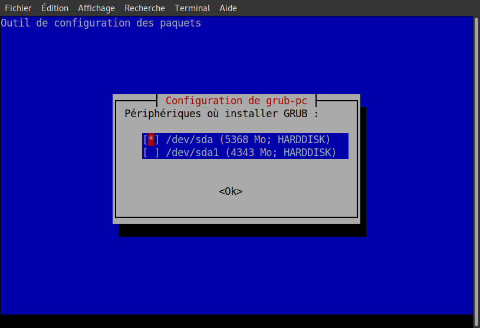

# SAÉ3.03 - Déploiement d'une application

Arthur DEBACQ - Pierre FOULON   
S3-G BUT Informatique

***Semaine 1 - Présentation générale et mise en place***

---

Table des matières :

- [SAÉ3.03 - Déploiement d'une application](#saé303---déploiement-dune-application)
  - [***Glossaire***](#glossaire)
  - [***Première connexion à distance***](#première-connexion-à-distance)
    - [***Empreinte des clés***](#empreinte-des-clés)
    - [***Faciliter la connexion***](#faciliter-la-connexion)
    - [***Diffuser la clé publique à la machine de virtualisation***](#diffuser-la-clé-publique-à-la-machine-de-virtualisation)
  - [***Créer et gérer des machines virtuelles***](#créer-et-gérer-des-machines-virtuelles)
    - [***Script vmiut***](#script-vmiut)
    - [***Création et gestion de machine virtuelle***](#création-et-gestion-de-machine-virtuelle)
    - [***Informations sur le réseazu et la VM***](#informations-sur-le-réseazu-et-la-vm)
    - [***Utilisation de la machine virtuelle***](#utilisation-de-la-machine-virtuelle)
      - [***Console virtuelle***](#console-virtuelle)
      - [***Connexion SSH***](#connexion-ssh)
      - [***Configurer l'adresse de la machine virtuelle***](#configurer-ladresse-de-la-machine-virtuelle)
      - [***Configurer l'adresse du serveur DNS***](#configurer-ladresse-du-serveur-dns)
  - [***Configurer et mettre à jour la machine virtuelle***](#configurer-et-mettre-à-jour-la-machine-virtuelle)
    - [***Connexion root et SSH***](#connexion-root-et-ssh)
    - [***Configuration du proxy***](#configuration-du-proxy)
    - [***Mise à jour***](#mise-à-jour)
    - [***Quelques trucs en plus***](#quelques-trucs-en-plus)

---

## ***Glossaire***

Nous allons utiliser plusieurs acronymes au cours de la procédure :  

**phys** représente la machine physique.  
**virtu** représete la machine de virtualisation.  
**vm** représente la machine virtuelle.  

---

## ***Première connexion à distance***

Afin de se conneter à la **machine de virtualisation** nous allons utiliser la commande ```bash``` :  

Le **protocole SSH** est un **protocole réseau** qui permet aux administrateurs d'**accéder à distance** à un ordinateur sur un réseau, d'**exécuter des commandes** et de **déplacer des fichiers** d'un ordinateur à un autre.  

Se connecter à la machine de virtualisation à l'iut via la machine physique :

```bash
login@phys$ ssh virtu.iutinfo.fr 
```

à la maison :

```bash
login@phys$ ssh login@virtu.iutinfo.fr   
```

le login étant l'adresse mail universitaire.

---

### ***Empreinte des clés***  

Si vous n'avez **jamais** lancé la commande ```bash``` sur la machine physique, un message du **client SSH** vous demandera si vous souhaitez faire confiance à ce serveur SSH car il ne **peut pas verifier** l'identité de celui ci.

Afin de vérifier si vous vous connectez **au bon serveur SSH**, il faut **vérifier l'empreinte** de la clé. L'**empreinte d'une clé** est une courte séquence d'octets utilisée pour identifier une clé publique plus longue, elle est fournie par l'hébergeur ou l'admnistrateur.

ecrire cle exemple

Une fois que vous avez vérifier **l'authenticité de l'empreinte** entrez ```yes``` à la question du client SSH. Vous devez retaper votre mot de passe puis enfin **accéder à la machine de virtualisation**.

---

### ***Faciliter la connexion***  

Maintenant nous allons faciliter la connexion dans l'objectif d'**éviter de saisir notre mot de passe** à tout bout de champ.

En effet, le client SSH permet de s'authentifier d'une autre manière grâce au mécanisme de **cryptographie asymétrique**. En effet, via une paire de clé composée d'une **clé publique** et **privé**.

Nous allons donc **fabriquer notre paire de clés** en utilisant la commande :

```bash
ssh-keygen
```

Au cours de l'usage de la commande, il vous sera demander :

- [1] Le nom de fichier de sauvegarde des clés: il est **important** de **noter** le nom du fichier quelque part.
- [2] une ***passphrase*** : c’est un **mot de passe** qui permet de **chiffrer le fichier** contenant votre clé privé. Il est très important d’utiliser un mot de passe pertinent. Ainsi, si on vous vole le fichier, le voleur ne pourra pas se servir de votre clé.

Une fois la paire de clés crée, nous devons **transmettre** la clé publique à la machine de virtualisation.

---

### ***Diffuser la clé publique à la machine de virtualisation***

```bash
login@phys$ ssh-copy-id virtu.iutinfo.fr
```

Lorsque ceci fait, vous pourrez vous connecter automatiquement sans utiliser de mot de passe ni de passphrase à la **machine de virtualisation** où nous allons **créer et gérer** des machines virtuelles.

---

## ***Créer et gérer des machines virtuelles***

**<span style="color: red">/!\ Les commandes de cette partie doivent être exécutées sur votre machine de virtualisation !**

Après s'être connecté à la machine de virtualisation, à l'aide d'un script conçu spécialement pour la gestion de machine virtuelle via le terminal nommé `vmiut`, vous pourrez créer et gérer des machines sur celle-ci.

---

### ***Script vmiut***  

Pour utiliser le `vmiut`, il faut executer cette commande :

```bash
login@virtu$ source /home/public/vm/vm.env
```

Cependant, le script n'étant pas situé dans un chemin standard du système nous devrons exécuter la commande source à chaque nouveau terminal. De manière à éviter la ré-exécution de la commande à chaque nouvelle instance de shell, vous pouvez inscrire la ligne ci-dessous dans le fichier `.bashrc` à l'aide de la commande `nano`.

> source /home/public/vm/vm.env > /dev/null

Le script étant fonctionnel, vous pouvez maintenant créer et gérer des machines virtuelles.  

---

### ***Création et gestion de machine virtuelle***

Pour **créer une VM**, éxecutez la commande suivante :

```bash
login@virtu$ vmiut creer nomMachine
```

Une fois le processus de création d'une VM terminer vous pouvez **lister les VM existante** via :

```bash
login@virtu$ vmiut lister
```

Pour **démarrer la VM** nomMachine, utilisez la commande suivante :

```bash
login@virtu$ vmiut demarrer nomMachine                
```

Pour **arrêter la VM *nomMachine*** <span style="color: red">(***Ne pas oublier d'arrêter la machine afin de ne pas utiliser inutilement les ressources !***) :

```bash
login@virtu$ vmiut arreter nomMachine
```

Pour **supprimer la VM *nomMachine*** il faut avoir précedemment l'avoir arrêté puis utiliser la commande suivante :

```bash
login@virtu$ vmiut supprimer nomMachine
```

Contrairement à la commande lister la commande info **liste les infos** de la VM *nomMachine* tel que **l'état de celle-ci,ip-possible,nom,etc** :

```bash
login@virtu$ vmiut info nomMachine
```

<p id="ssh-X"></p>

Afin **d'utiliser la console** de notre machine virtuelle *nomMachine*, il faut avoir s'être connecté à notre machine de virtualisation avec l'option -X  de la commande ssh (`ssh -X virtu`) puis executer la commande suivante :

```bash
login@virtu$ vmiut console nomMachine
```

---

### ***Informations sur le réseazu et la VM***

| Machine | Adresse |
|---------|---------|
|Machine de virtualisation|192.168.194.1|
|Routeur, DNS|192.168.194.2|
|Adresses dynamiques (attribuées automatiquement)|192.168.194.25-192.168.194.128|

Ce tableau réprésente le **réseau virtuel principal** comme nous pouvons le constater via la commande `vmiut info` notre machine virtuelle possède une adresse IP dans le réseau 192.168.194.0/24, donc notre réseau virtuel.

---

### ***Utilisation de la machine virtuelle***

La création de notre machine virtuelle désormais effectué, pour l'utiliser deux solutions s'offre à vous :

- via une console virtuelle connectés physiquement à la machine virtuelle.
- se connecter en SSH.

---

#### ***Console virtuelle***

Pour utiliser la console virtuelle de notre machine virtuelle via la console virtuelle il est, au préalable, **nécessaire de lancer notre machine de virtualisation** avec le **paramètre -X** de la commande SSH comme vu précédemment sans quoi vous aurez le message d'erreur suivant :

> ERROR: Failed to open display:

En effet, vous êtes **connecté à distance** sur la machine de virtualisation et la console virtuelle étant **une application graphique** elle ne peut donc pas **afficher sa fenêtre**.

Le paramètre -X permet de palier à ce problème car il **permet la redirection graphique**.

Maintenant que vous avez accès à la console virtuelle vous pouvez vous connecter en temps que **root** afin de vérifier que les paramètres réseau correspondent grâce aux commandes `ip addr show` ou encore `ip route show`.

---

#### ***Connexion SSH***  

Du côté de la connexion SSH, rien de plus simple il suffit d'éxecuter la commande suivante :

```bash
login@virtu$ ssh user@192.168.194.xx
```

En considérant que xx est le nombre correspondant à la sortie de la commande ``vmiut info nomMachine``.

---

#### ***Configurer l'adresse de la machine virtuelle***  

Notre objectif ici est de faire de notre machine virtuelle un **serveur hébergeant un service**, il faut donc alors qu'elle est une **adresse IP fixe**. Dans notre cas nous allons utiliser ***l'adresse 192.168.194.3***.

Depuis la console virtuelle (de notre machine virtuelle), vous pouvez donc **couper l'interface réseau** à l'aide de la commande :  

```bash
root@vm# ifdown enp0s3
```

enp0s3 étant l'interface réseau que nous allons utilisé.

Ensuite éditez le fichier de configuration des interfaces réseaux nommé ***interfaces*** de sorte à ce que notre **machine virtuelle** ait **l'adresse statique 192.168.194.3** et utilise le **routeur 192.168.194.2**. Vous utiliserez le commande `nano` pour éditer.

```bash
root@vm# nano /etc/network/interfaces
```

À l'aide des pages de manuel interfaces(5), nous apprenons que pour l'affectation d'une adresse static il suffit d'écrire `static address` suivi de l'adresse. Idem pour l'utilisation d'un routeur le mot clé `gateway` suivi de l'adresse suffit.

Ainsi il est évident d'inscrire dans le fichier ***interfaces*** la ligne suivante.

```bash
iface enp0s3 inet static 
        address 192.168.194.3 
        gateway 192.168.194.2
```

La VM étant un serveur il faut configurer l'adresse DNS de celui-ci.

---

#### ***Configurer l'adresse du serveur DNS***  

La **même procédure** que la **configuration de l'interface réseau** à l'exception que le fichier a édité est ***resolv.conf*** qui sert a configurer le resolveur du système de noms de domaine du système. L'adresse du **serveur DNS** doit être **192.168.194.2**.

```nano /etc/resolv.conf```

puis y inscrire la ligne suivante :

```bash
domain univ-lille.fr
search univ-lille.fr 
nameserver 192.168.194.2
```

Vous pouvez **redémarrer l'interface réseau** avec la commande `ifup` :

```bash
root@vm# ifup enp0s3
```

Pour **vérifier** que l'adresse de l'interface, l'adrese du routeur et la configuration DNS fonctionne correctement, vous utiliserez les commandes suivantes chacun en ce qui le concerne :  

``ip addr show`` / ``ip route show`` / ``host www.univ-lille.fr``

Une fois les verifications effectués vous pourvez **redémarrer la machine virtuelle** :

```bash
root@vm# reboot
```

---

## ***Configurer et mettre à jour la machine virtuelle***

### ***Connexion root et SSH***

La commande `ssh user@192.168.194.3` permet de se **connecter à notre machine virtuelle en tant que user**, vous avez déjà peut être essayé de vous connecter en tant que **root** en **substituant** le user par root.

Cependant vous avez remarqué que cela est **impossible** car vous obtenez le message d'erreur suivant :
>Permission denied.

En effet le l'**accès vous est refusé** car pour le service ssh le mot de passe de l'utilisateur root n'est pas **assez sécurisé**. C'est pourquoi il est obligatoire de passer par l'utilisateur `user` pour se connecter en tant que root via la commande :

```bash
user@vm# su -
```

Cependant il existe le paramètre `--login` à la commande `su` qui est en soit **plus intéressant à utiliser** que le simple `-`. En effet, le paramètre `--login` signifie que le **client ssh demandera** alors si l'utilisateur qui tente de se connecter **veut se connecter** avec l'utilisateur user ou root ce qui **permet un gain de temps et d'efficacité**.

---

### ***Configuration du proxy***

Ensuite vous allez modifier le fichier `/etc/environment` via la commande :

```bash
root@vm# nano /etc/environnement
```

Il doit contenir les lignes suivantes, sans quoi vous ne pourrez pas **accéder à Internet** car le ***réseau virtuel principal*** est un **réseau est privé**, spécifique à votre machine virtuelle et n'a pas de routage. En d'autres termes, **aucune machine n'a accès à ce réseau** autre que **votre VM et votre machine de virtualisation** :

```
HTTP_PROXY=http://cache.univ-lille.fr:3128
HTTPS_PROXY=http://cache.univ-lille.fr:3128
http_proxy=http://cache.univ-lille.fr:3128
https_proxy=http://cache.univ-lille.fr:3128
NO_PROXY=localhost,192.168.194.0/24,172.18.48.0/22
```

---

### ***Mise à jour***

Il est toujours intéressant de **vérifier si notre système est à jour**, dans notre cas il sera surement **dépassé** alors pour le mettre à la page vous utiliserez le **gestionnaire de paquets Debian** nommé `APT`.

Ainsi à l'aide de la **page du manuel** `apt(1)`, la mise à jour du système s'effectue avec la commande `apt update` qui va aller **chercher les mises à jour du système et des applications installés** alors que la commande `apt full-upgrade` va permettre de **mettre à jour les paquets existants** et de plus **gérer les dépendances**.

La mise à jour système se fera donc avec la commande suivante :

```bash
root@vm# apt update && apt full-upgrade
```

Il est **important de cocher la case** `[ ] /dev/sda` à l'aide de la **barre ESPACE** lors du processus et valider avec **ENTRER**.



Pour **compléter la mise à jour** redémarrez la machine virtuelle :

```bash
root@vm# reboot
```

Nous allons maintenant **acquérir quelques outils** qui vont nous être utile toujours via le **gestionnaire de paquet** `apt` mais cette fois ci nous allons utiliser le paramètre ***install*** qui va nous permettre d'installer les outils ***vim***, ***less***, ***tree***, ***rsync***.

```bash
root@vm# apt install vim less tree rsync
```

---

### ***Quelques trucs en plus***

Par soucis d'efficacité, nous allons **configurer le client SSH** afin de permettre d'**utiliser des alias** de nos différents environnement de travail. Ceci va vous permettre de **gagner du temps** lorsque vous voudrez vous connecter en ssh à à la machine de virtualisation ou la machine virtuelle.

Pour ce faire nous allons éditer, toujours grâce à la commande `nano`, le fichier ***config*** se trouvant dans ce répertoire :

`$HOME/.ssh/config`

(Ici $HOME représente le **répertoire home de l’utilisateur sur le serveur** sur lequel celui-ci tente de se connecter.)

Vous allez donc créer un **alias se nommant virt** qui permettra de **remplacer le nom de la machine de virtualisation** par virt. Ainsi lorsque vous exécutez la commande `ssh virt` en réalité effectura la commande `ssh machine-de-virtualisation.iutinfo.fr`.

Un alias est donc une **substitution de commande abrégé**.

Un alias **vm** pour votre machine virtuelle et un autre **vmjump** pour pouvoir **se connecter a votre VM** depuis **votre machine physique** c'est à dire qu'elle fera d'abord la connexion sur la machine de virtualisation puis ensuite à la machine virtuelle le tout **automatiquement**.

Cependant il ne faut pas omettre d'effectuer **un transfert de l'agent SSH** afin que quand vous vous connecterez sur la machine de virtualisation, la **clé publique pourra alors être diffuseée** sur notre VM et la **clé privée pourra être utilisée**. À l'aide de la page du manuel `ssh_config(5)`, vous apprenez que **l'utilisation de la commande ssh** est sous cette forme :

- ssh user@hostname

et que le transfert d'agent est possible grâce à une ligne `ForwardAgent (yes/no)`.

Ainsi vous éditerez le fichier ***config*** avec les lignes suivantes :

```
Host virt
        User prenom.nom.etu
        HostName phys.iutinfo.fr
        ForwardAgent yes


Host vm
        User user
        HostName 192.168.194.3
        ForwardAgent yes


Host vmjump
        User user
        HostName 192.168.194.3
        ForwardAgent yes
        ProxyJump virt
```

Se connecter à la **machine de virtualisation** :

```bash
login@phys$ ssh virt
```

Se connecter à la **machine virtuelle** via **la machine de virtualisation** :

```bash
login@virt$ ssh vm
```

Se connecter à la **machine virtuelle** via **la machine physique** (***la machine virtuelle doit etre allumé***) :

```bash
login@phys$ ssh vmjump
```

Votre environnement de travail est maintenant prêt.