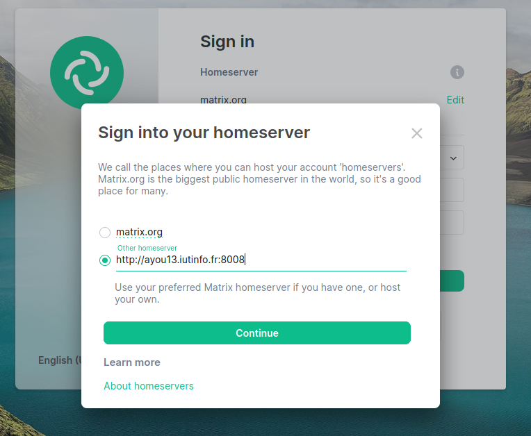
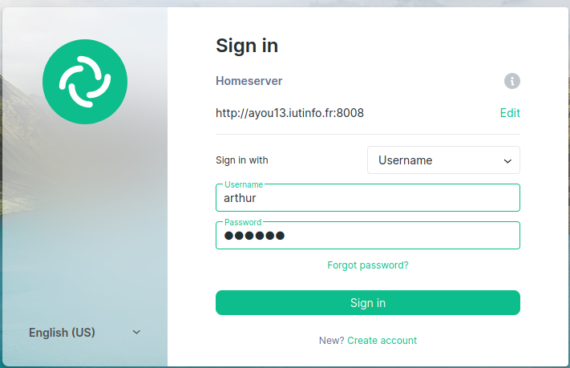
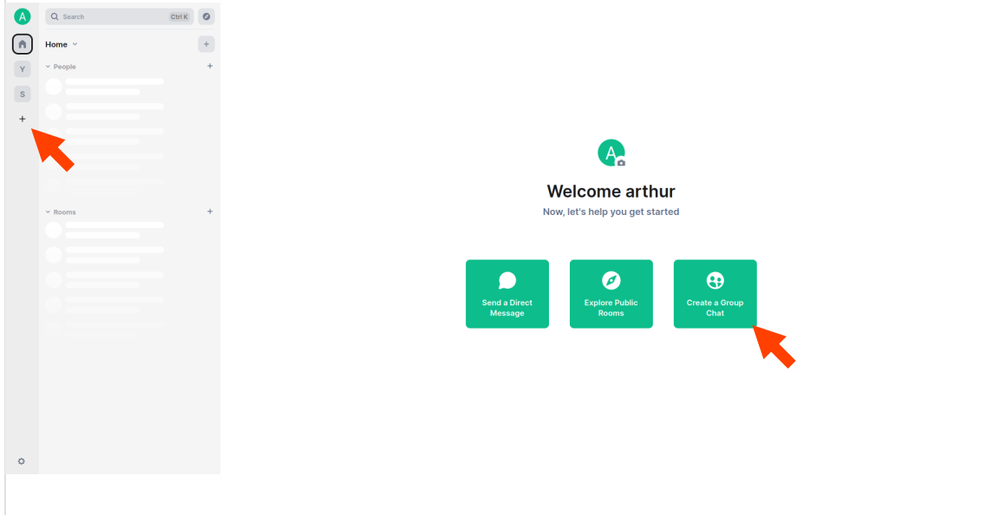
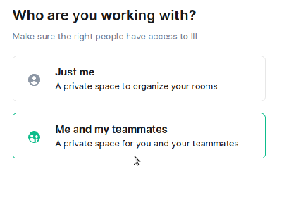
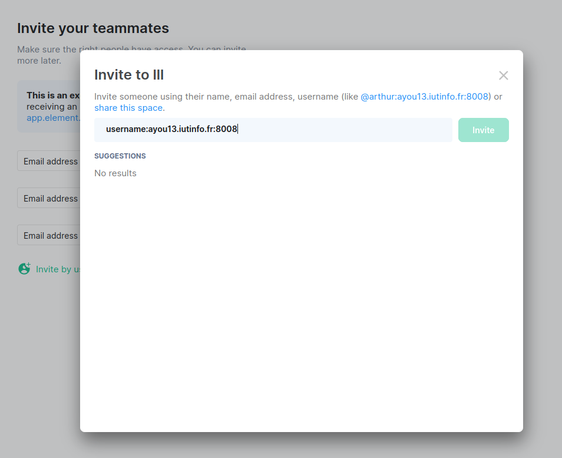

# SAÉ 3.03 - Déploiement d’une application - Procédure 03

Arthur DEBACQ - Pierre FOULON  
S3-G BUT Informatique

***Semaine 3 - Installation et configuration de Synapse***

---

Table des matières :

- [SAÉ 3.03 - Déploiement d’une application - Procédure 03](#saé-303---déploiement-dune-application---procédure-03)
  - [***Accès à un service HTTP sur la VM***](#accès-à-un-service-http-sur-la-vm)
    - [***Un premier service pour tester***](#un-premier-service-pour-tester)
    - [***Accès au service depuis la machine physique***](#accès-au-service-depuis-la-machine-physique)
  - [***Installation de Synapse***](#installation-de-synapse)
    - [***Installation sous Debian***](#installation-sous-debian)
    - [***Paramétrage spécifique dans un réseau privé***](#paramétrage-spécifique-dans-un-réseau-privé)
    - [***Utilisation d'une base Postgres***](#utilisation-dune-base-postgres)
    - [***Création d'utilisateurs***](#création-dutilisateurs)
    - [***Connexion à votre serveur Matrix***](#connexion-à-votre-serveur-matrix)
    - [***Activation de l'enregistrement des utilisateurs***](#activation-de-lenregistrement-des-utilisateurs)

---

## ***Accès à un service HTTP sur la VM***

### ***Un premier service pour tester***

- Installer le serveur HTTP `nginx` :

```bash
$ sudo apt install nginx
```

Pour vérfier que le processus fonctionne correctement:

```bash
$ systemctl status nginx
```

- Installer le client HTTP `curl` :

```bash
$ sudo apt install curl
```

- Vérifier l'accès au serveur via le client :

```bash
$ curl http://localhost
```

On ne peut pas accéder au serveur HTTP depuis la machine de virtualisation. Elle n'envoie aucune donnée vers l'extérieur. On n'obtient donc aucun résultat via la machine de virtualisation.

Pour y accéder il faut ajouter la VM a la liste de machine connue via la variable d'environnement `NO_PROXY` depuis la machine de virtualisation, cet ajout se fait dans le fichier `$HOME/.bashrc` :

```bash
export NO_PROXY=192.168.194.3
```

---

### ***Accès au service depuis la machine physique***

Il est impossible d'accéder directement au service de la machine virtuelle depuis la machine physique, elles ne sont pas sur le même réseau. On va donc passer par la machine de virtualisation pour envoyer nos requêtes.  
Depuis la machine virtualisation :

```bash
$ ssh -L 0.0.0.0:8080:192.168.194.3:80 user@192.168.194.3
```

Tant que la connection avec la machine virtuelle est établie on peut accéder à la page web de nginx depuis la machine physique, il faut entrer dans la barre d'URL :

```url
http://machine-de-virtualisation.iutinfo.fr:9090
```

En remplacant `machine-de-virtualisation` par le nom de notre machine de virtualisation.

Pour pouvoir y accéder à tout moment il faut modifier `.ssh/config` et y ajouter la ligne suivante pour la connection à la VM :

```bash
Host vm
    User user
    HostName 192.168.194.3
    ForwardAgent yes
    LocalForward 0.0.0.0:9090 192.168.194.3:80
```

- A partir de maintenant, lorsqu'on se connecte à la VM via la commande `ssh vm` depuis la machine de virtualisation, on peut accéder au service de la machine virtuelle depuis le réseau.

---

## ***Installation de Synapse***

### ***Installation sous Debian***  

Nous allons maintenant installer Synapse, l'**implémentation de réference** pour un serveur Matrix.  

Pour obtenir une installation complète nous allons suivre la procédure d'installation de la [**documentation officiel Synapse**](https://matrix-org.github.io/synapse/latest/setup/installation.html). Dans la documentation il est inscrit d'exécuter ces commandes une à une ci-dessous afin d'installer Synapse sous l'architecture amd64 :

```bash
$ sudo apt install -y lsb-release wget apt-transport-https
$ sudo wget -O /usr/share/keyrings/matrix-org-archive-keyring.gpg https://packages.matrix.org/debian/matrix-org-archive-keyring.gpg
$ echo "deb [signed-by=/usr/share/keyrings/matrix-org-archive-keyring.gpg] https://packages.matrix.org/debian/ $(lsb_release -cs) main" |
    sudo tee /etc/apt/sources.list.d/matrix-org.list
$ sudo apt update
$ sudo apt install matrix-synapse-py3
```

A la suite de la commande `sudo apt install matrix-synapse-py3` le gestionnaire de paquet demande **le nom de notre instance** à la suite de cette demande nous allons lui indiquer **le nom de notre machine virtualisation** accompagné de **l'adresse iutinfo.fr** et le **port 8008** ainsi nous nous retrouvons avec :  

`nom-de-machine-virtu.iutinfo.fr:8008`  

A la suite de l'installation **les logs** pourront être **consultable** dans le fichier :  

`/var/log/matrix-synapse/homeserver.log`

---
### ***Paramétrage spécifique dans un réseau privé***  

Etant dans une situation particulière, nous souhaitons empêcher notre serveur de contacter d'autres serveurs pour récupérer des clés de signature publique. Pour cela, nous allons suivre la documentation en configurant la variable trusted_key_servers à une liste vide ([]).

```bash
$ sudo nano /etc/matrix-synapse/homeserver.yaml
```

Puis y inscrire la ligne suivante dans la section **database**:

`trusted_key_servers : []`

---
### ***Utilisation d'une base Postgres***

Synapse utilise une base de données au format fichier `sqlite` cependant ce n'est pas **suffisant** pour notre production, nous allons donc plutôt utiliser une base `postgre`.

Premièrement nous devons **supprimer la base** que nous avions précedemment créer car les options par défaut ne seront **pas acceptés** par Synapse. Nous allons donc passer en **utilisateur postgres** pour pouvoir manipuler les commandes psql :

```bash
sudo -u postgres -i  
```

Une fois en utilisateur postgres nous allons **supprimer** notre précédente base grâce à la commande psql suivante :

```bash
dropdb nomDeLaBase
```  

Nous pouvons **vérifié** si la base a été bien supprimé avec la commande suivante qui liste toutes les bases :

```bash
psql -l
```

Une fois la base antérieure supprimé il nous faut en **recréer** une accompagnée des bonnes options :  

```bash
postgres@matrix:~$ createdb --encoding=UTF8 --locale=C --template=template0 --owner=matrix matrix
```

Maintenant nous allons modifier le fichier de configurations `homserver.yaml` afin d'utiliser la **base postgres**

```bash
$ sudo nano /etc/matrix-synapse/homeserver.yaml
```

Puis dans la section **database** changer les lignes suivantes avec les **valeurs** suivantes :

```bash
name : psycopg2
args :
    user: matrix
    password: matrix
    database: matrix
    host: localhost
    cp_min: 5
    cp_max: 10
```

l'option `psycopg2` signifie que nous voulons utiliser la base **Postgres** tandis que les différentes options de **args** indique les identifiants pour accéder à la base.

Ne pas oublier de supprimer la ligne :

```bash
database: /var/lib/matrix-synapse/homeserver.db
```

Pour prendre en compte les changements, nous pouvons **redémarrer le serveur** :

```bash
$ sudo systemctl restart matrix-synapse.service
```

---

### ***Création d'utilisateurs***

Nous allons maintenant **créer des utilisateurs** sur notre serveur à l'aide d'un **script** installé avec notre serveur Synapse nommé `register_new_matrix_user`.

Cependant pour utiliser le script nous devons **spécifier une clé partagée d'enregistrement** dans sa configuration.

```bash
$ sudo nano /etc/matrix-synapse/homeserver.yaml
```

Puis inscrire la **variable de configuration** `registration_shared_secret` affecté à votre propre clé partagée d'enregistrement :

`registration_shared_secret: VotreSecretPhrase`  

Une fois muni de la clé partagée d'enregistrement, nous pouvons **créer nos utilisateurs** en éxecutant le script :

```bash
$ register_new_matrix_user -c homeserver.yaml
```

Il faudra alors **renseigner les informations de l'utilisateur** à la suite sachant que ceci **peut être éviter** en utilisant les options :
`-u` -permet de renseigner le nom de l'utilisateur.
̀`-p` -permet de renseigner le mot de passe de l'utilisateur.
`-a` -permet de renseigner si l'utilisateur est admin ou pas.

l'option `-c` suivi du fichier ou du chemin vers le fichier de configuration yaml permet d'**éviter de visualiser la secret phrase** avec l'option `-k` dans la commande. En effet l'option `-c` permet d'aller **chercher dans le fichier** de configuration la secret phrase.

Pour voir la liste des utilisateurs enregistrés, il faut se connecter en tant qu'utilisateur **postgres** à la base de donnée de notre serveur (ici matrix) :

```bash
$ sudo -u postgres psql -d matrix
```

Puis faire un `SELECT name FROM users;`

---
### ***Connexion à votre serveur Matrix***

Nos deux utilisateurs maintenant crée, nous allons maintenant essayer de nous **connecter à notre serveur via un client Web** nommé ***Element***.

Nous avons besoin que toutes les connexions entrantes sur le port 8008 sur la machine de virtualisation soient redirigées vers le port 8008 sur la machine distante "vm". Cela permet d'accéder à des services ou des applications sur la machine distante via la machine de virtualisation.

Pour cela on modifie le `fichier de configuration SSH` avec la commande:

```bash
$ nano .ssh/config
```

Et on y ajoute pour notre connection à l'hôte vm la redirection vers le port **8008** :

```bash
Host vm
    [...]
    LocalForward 0.0.0.0:8008 localhost:8008
```

Ceci fait, nous allons nous rendre sur le [client web Element](http://tp.iutinfo.fr:8888/) puis dans l'onglet `Sign In (ou Se Connecter en français)`pour pouvoir se connecter à notre serveur il faut **indiquer au client** car **par défaut il se connectera au serveur** nommé `matrix.org`.

Pour ce faire **rendez-vous dans la section** `Homeserver` puis **cliquer sur le bouton** `Edit` et **cocher la case** `Other` enfin **renseignez le champ** par `l'adresse de notre serveur` c'est à dire dans notre cas :

<http://ayou13.iutinfo.fr:8008>  
ou  
<http://acajou05.iutinfo.fr:8008>  

  
  

Ensuite, nous n'avons plus qu'à **nous connecter avec les utilisateurs que nous avons précédémment crée** dans notre base en y **renseignant** notamment **le nom d'utilisateur** et **le mot de passe**.



Une fois l'utilisateur connecté, nous pouvons **créer un salon de disscusion** en cliquant sur le **bouton +** en haut à droite de notre client ou via **le bouton de l'interface de bienvenue** :



On renseigne **le nom du salon** ainsi que **la description** et on indique que l'on souhaite que **le salon soit privé**.



Il est temps maintenant de passer à **l'invitation du deuxième utilisateurs** que nous avons créer pour ça **lors de la création du salon** le client nous invitera à inviter des membres, nous allons donc cliquer sur `Invite by username` et on renseigne **le nom d'utilisateur de l'invité précédé d'un arobase puis suivi de l'adresse de notre serveur**, par exemple :

`@username:ayou13.iutinfo.fr:8008`



Lorsque l'on se connecte au compte de l'utilisateur invité celui-ci est en mesure d'**accepter l'invitation au salon** et de **parler avec les autres membres du groupe**.

---
### ***Activation de l'enregistrement des utilisateurs***

Maintenant nous souhaitons que **les utilisateurs qui ne possèdent pas encore de compte** puissent en **créer via le client** et non manuellement via l'administrateur qui utilise le script de création d'utilisateurs.

On constate que lorsque l'on désire créer un compte via `Create a account` de la page de connexion cela **n'est pas possible** car le client web nous informe que **le serveur n'autorise pas les inscriptions par les utilisateurs**.

Pour autoriser le serveur à enregistrer les utilisateurs par eux-mêmes il faut **rajouter la variable de configuration** `enable_registration` dans notre fichier de configuration de serveur `homeserver.yaml`.

Pour ce faire :

```bash
sudo nano /etc/matrix-synapse/homeserver.yaml
```

Et l'on y inscrit à la suite **les variables de configuration** suivant ainsi que **leurs valeurs de configuration** ici à **true** car nous voulons **autorisé les enregistrements**.

```bash
enable_registration: true
enable_registration_without_verification: true
```

Pour **prendre en compte les changements** nous devons **redemarrer le service matrix-synapse** :

```bash
sudo systemctl restart matrix-synapse.service
```

On constate maintenant que nous pouvons créer des utilisateurs.
